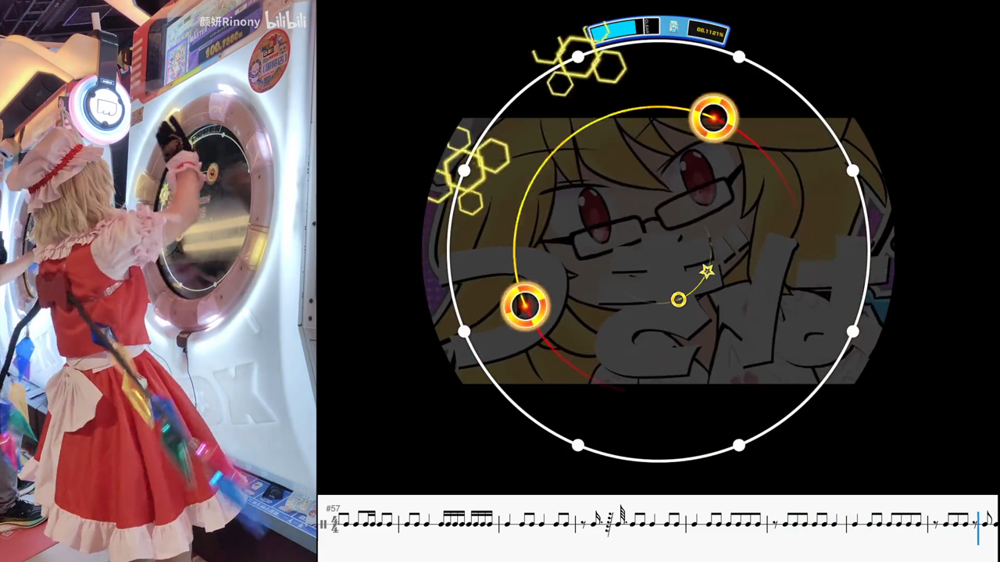

# simai2midi — maimai charts → percussion rhythm tracks

Convert **maimai (舞萌 DX) simai charts** into three things:

1. **Percussion MIDI** — every hit becomes a hand clap on GM drum channel 9
   (note 39). Drop it into a DAW as a rhythm reference or practice track.
2. **MusicXML rhythm score** — single-line percussion staff, one notehead per
   hit, opens cleanly in **MuseScore**.
3. **PDF rhythm score** — typeset from the MusicXML, ready to print or share.

In one sentence: **turn "a chart on screen" into "a rhythm track you can hear,
count, and print".**

[](https://github.com/ciisaichan/simai2midi/releases/download/v1.0.0/demo.mp4)

▶ **[Watch the demo](https://github.com/ciisaichan/simai2midi/releases/download/v1.0.0/demo.mp4)**
(*インターネットサバイバー* Master, 56 s, 1080p60, 31 MB — shipped as a release asset, so the repository stays small)

> To get an inline player on GitHub: drag `demo.mp4` into an issue or
> comment box, then paste the URL GitHub gives you into the README.

#### Demo video credits

| Position | Content | Source |
| --- | --- | --- |
| Left | Hand-cam (arcade play) | [bilibili BV1qjztYVE4W](https://www.bilibili.com/video/BV1qjztYVE4W) |
| Top right | In-game chart | [bilibili BV1kU421d74K](https://www.bilibili.com/video/BV1kU421d74K/) |
| Bottom right | Rhythm score (MIDI generated by this project) | played in **MuseScore 4** |

All footage and music belong to their respective creators and SEGA; it is shown
for illustration only and the audio has been attenuated.

中文说明见 [README.md](README.md)。

## Features

- **Pure Python**, nothing to compile. Only `mido` is required if you just
  want MIDI.
- **Full simai parsing**: TAP / HOLD / SLIDE / TOUCH / BREAK / EX, including
  slide traces (`- > < ^ v p q s z pp qq V w`), `{div}` divisions, `(bpm)`
  tempo changes, `{#seconds}` durations, EACH / pseudo-EACH, and `&first`
  offsets.
- **Correct timeline**: tempo changes mid-chart are handled with a piecewise
  linear seconds → ticks map, so absolute timing stays exact after a change.
- **Optional density control**: tail notes (`--tails`), slide traces expanded
  to every button (`--slide-dense`), resampling dense runs
  (`--resample 32/16`).
- **Scores that actually open**: tuplets are rebuilt **per beat** into legal
  groups, preserving the "3" brackets without triggering MuseScore's
  "incomplete measure" error. This was the hardest part of the project —
  see the [technical notes](docs/README.original.md).
- **Built-in verification**: MIDI is re-read and compared hit by hit against
  the source chart; scores are checked against seven structural invariants.

## Install

Requires **Python 3.9+**.

```bash
git clone https://github.com/ciisaichan/simai2midi.git
cd simai2midi

pip install -r requirements.txt          # MIDI only: just mido
pip install -r requirements-score.txt    # MusicXML / PDF export as well
```

On macOS `cairosvg` needs system libcairo:

```bash
brew install cairo
```

## Quick start

```bash
# Highest difficulty in the file
python simai2midi.py maidata.txt -o out.mid

# Pick a difficulty slot (1=Easy 2=Basic 3=Advanced 4=Expert 5=Master 6=Re:Master 7=UTAGE)
python simai2midi.py maidata.txt -d 6 -o remaster.mid

# All difficulties at once (named Title_Difficulty.mid)
python simai2midi.py maidata.txt --all -O out/

# Include the score
python simai2midi.py maidata.txt --all -O out/ --musicxml --pdf

# Bare inote body (no & header): supply BPM and offset yourself
python simai2midi.py inote.simai --bpm 174 --first 1.234 -o out.mid

# Denser rolls: expand every button along a slide path
python simai2midi.py maidata.txt -d 6 --slide-dense

# Resample 32nd-and-denser runs down to 16ths
python simai2midi.py maidata.txt -d 6 --resample 32/16
```

`input` may be a `maidata.txt` (with `&inote_x=` sections) or a bare text file
containing only the chart body.

## CLI options

| Option | Meaning |
| --- | --- |
| `input` | `maidata.txt` or a bare inote body file |
| `-o, --output PATH` | Output `.mid` path (single difficulty) |
| `-O, --outdir DIR` | Output directory for batch export |
| `-d, --difficulty N` | Difficulty slot 1–7, repeatable; defaults to the highest |
| `--all` | Export every difficulty in the file |
| `--bpm N` | Default BPM when the chart has no `(bpm)` (else `&wholebpm`, else 120) |
| `--first SEC` / `--no-offset` | Override / ignore the `&first` offset |
| `--distinct` | Different drum sounds per note type (easier to tell apart in a DAW) |
| `--hold-sustain` | HOLD / TOUCH HOLD sustain for their real length (default: one short hit) |
| `--slide-dense` | Expand every button along a slide (`> < ^`) |
| `--tails` | Include HOLD / SLIDE tail hits (default: off) |
| `--resample S/T` | Resample S-th-note-and-denser runs to T-th notes (e.g. `32/16`) |
| `--musicxml` | Also write a MusicXML score (`*.musicxml`) |
| `--pdf` | Also write a PDF score (`*.pdf`, rendered from the MusicXML) |
| `--time-sig N/D` | Score time signature (default `4/4`) |
| `--score-grid N` | Score quantisation grid as a division denominator (default `192`=10 ticks; exactly represents both 32nds and triplet 16ths) |
| `--score-note-div N` | Notehead length (default `8` = eighth note; `16` = shorter, more rests) |
| `--score-binary` | Escape hatch: no tuplets at all, onsets snapped to a 128th grid. Triplets get written out as plain notes |
| `--velocity V` / `--break-velocity V` | Velocity for normal / BREAK notes (default 100 / 127) |
| `-q, --quiet` | Print only the output path |

### Hit expansion and tails

Each note expands into one or more "hits":

- TAP / TOUCH: 1 hit (the head)
- HOLD / TOUCH HOLD: 1 hit; with `--tails`, plus the release moment
- SLIDE: head + every intermediate button (chain-slide middles, big-V vias);
  with `--tails`, plus the endpoint

Without `--tails` you get a pure percussion rhythm — exactly the moments the
game asks you to press something.

### DISTINCT drum mapping

With `--distinct` each note type gets its own drum:

| Note | Drum | MIDI pitch |
| --- | --- | --- |
| TAP | Hand Clap | 39 |
| HOLD | Cowbell | 56 |
| SLIDE | Tambourine | 54 |
| TOUCH | Closed Hi-Hat | 42 |
| TOUCH HOLD | Open Hi-Hat | 46 |
| BREAK | Crash Cymbal 1 | 49 |

Without it, everything is a Hand Clap (39).

### Slide resampling (`--resample S/T`)

A "slide trace" is a burst of rapid consecutive notes (32nds, 64ths…). In play
you *sweep* rather than tap each one. `--resample S/T` resamples runs of
S-th-notes-and-denser onto a T-th grid, keeping one hit per grid step relative
to the run's start.

```bash
python simai2midi.py maidata.txt --all -O out/ --resample 32/16
python simai2midi.py maidata.txt --all -O out/ --resample 64/16   # more aggressive
```

## Output files

Given `maidata.txt` and `-d 6`:

```
maidata.mid          # hand-clap rhythm MIDI (always produced)
maidata.musicxml     # percussion score, opens in MuseScore
maidata.pdf          # typeset PDF score
```

With `-O out/` files are named from `&title` and the difficulty, e.g.
`インターネットサバイバー_Master.mid`. When `--pdf` is used alone, the
MusicXML is a temporary intermediate file.

## Supported simai syntax

- BPM and durations: `(bpm)`, `{div}`, `{#seconds}`, switchable anywhere
- TAP: `1`, BREAK `1b`, EX `1x`, star `1$`/`1$$`, modifiers in any order
- HOLD: `5h[2:1]`, `4h[#5.678]`, `4h[150#2:1]`, pseudo-TAP `3h` (= `[1280:1]`)
- SLIDE: all shapes `- > < ^ v p q s z pp qq V w`; durations `[8:3]`,
  `[160#8:3]`, `[160#2]`, `[3##1.5]`, `[3##8:3]`, `[3##160#8:3]`
- Multi-segment slides `1-4[4:3]*-6[8:5]` and chained slides `1-4q7-2[1:2]`
- TOUCH / TOUCH HOLD: `B1`, `D4`, `C` (`C1`/`C2` normalised to `C`), `B7f`
- EACH: `1/8h[2:1]`, shorthand `12`; pseudo-EACH: `` 1`2`3/4 ``
- Star suppression `?` / `!`, star-to-TAP `@`
- Terminator `E`, `||` comments, arbitrary whitespace

## FAQ

**MuseScore says "incomplete measure" when opening the MusicXML?**
It shouldn't any more. The root cause is that music21 attaches tuplet marks
note by note, chopping groups apart, so MuseScore recomputes measure lengths
from the notated values and gets it wrong — it even shifted whole measures
(its re-exported MIDI matched only 66.7% of hits). Rebuilding tuplets **per
beat** fixed it: MuseScore 4 now opens the files with no errors and its
exported audio matches the MIDI exactly. For pathological charts you can fall
back to `--score-binary` (no tuplets at all, triplets written out plainly).

**`no library called "cairo-2" was found`?**
`cairosvg` needs system libcairo — `brew install cairo` on macOS,
`apt install libcairo2` on Debian/Ubuntu.

**I only want MIDI — do I need all those score dependencies?**
No. Score-related imports are deferred until used, so `requirements.txt`
(just `mido`) is enough unless you pass `--musicxml` / `--pdf`.

**Non-ASCII titles?**
Handled. `midi_writer.save_midi()` sets mido's `charset='utf-8'` on the
`MidiFile` *instance* (module-level settings do not work) and writes through a
temp file + `os.replace`, so an encoding failure can never leave a truncated
`.mid` behind.

**Where do I get charts?**
This project ships **no chart data** (see the copyright note below). Community
mirrors such as [adxdls.saop.cc](https://adxdls.saop.cc/charts) host charts;
grammar reference: [simai wiki](https://w.atwiki.jp/simai/pages/1002.html).

## Project layout

```
simai2midi.py        # CLI entry point
simai_parser.py      # simai grammar → notes with absolute seconds
slide_geometry.py    # slide geometry: button positions, arc direction, path length
midi_writer.py       # notes → percussion MIDI (TickMap seconds→ticks)
score_writer.py      # notes → MusicXML → verovio SVG → cairosvg PDF
verify_midi.py       # single-file read-back verification
verify_all.py        # batch read-back verification
test_*.py            # unit tests (run with python test_xxx.py; no pytest needed)
docs/                # demo video, technical notes, original README backup
```

## Tests

No sample charts are bundled — bring your own `maidata.txt`:

```bash
python test_simai_parser.py      # parser
python test_midi_writer.py       # MIDI writing (non-ASCII titles, tails, atomic save)
python test_score_writer.py      # score notation
python verify_midi.py maidata.txt 6 out.mid
python verify_all.py
```

`verify_*.py` re-parses the source chart and compares every note-on's absolute
time against the parsed result, checking channel and instrument as well. The
only deviation comes from 480-tick-per-beat quantisation — a measured maximum
of **0.6 ms**, far below any audible threshold.

## Known limitations

- The `--score-binary` escape hatch can overflow measure lengths on rare
  charts (e.g. measures 50/51 of PANDORA PARADOXXX). The default path is
  unaffected; the flag exists only for compatibility.
- Scores are quantised to a 192nd grid (10 ticks) by default. `--score-grid 64`
  will mis-notate triplet divisions unless the chart has none.
- PDF layout uses verovio's default; the title block is injected into the SVG
  by this project (verovio's embedded font has no CJK glyphs).

## Technical notes

Implementation details — the music21 exporter pitfalls, per-beat tuplet
rebuilding, verovio/cairosvg rendering issues, the quantisation grid trade-off,
and all measured numbers — live in [docs/README.original.md](docs/README.original.md)
(written in Chinese).

## Credits and licence

- Code released under the [MIT licence](LICENSE).
- Parsing approach informed by community projects such as
  [MajdataView / MajdataViewX](https://github.com/LingFeng-bbben/MajdataView).
- Score typesetting uses [verovio](https://www.verovio.org/) and
  [music21](https://web.mit.edu/music21/).

### Copyright

**This project contains no maimai chart data, no song audio and no game
assets.** maimai / 舞萌 DX songs, charts and assets are copyright **SEGA**.
Please do not commit chart data or game audio here. The demo video uses a song
for illustration only, with its audio attenuated.
